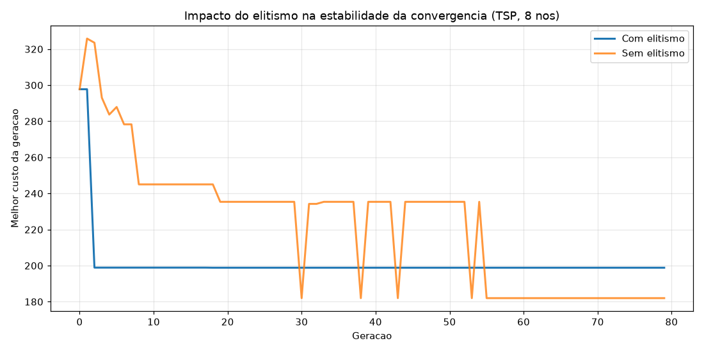
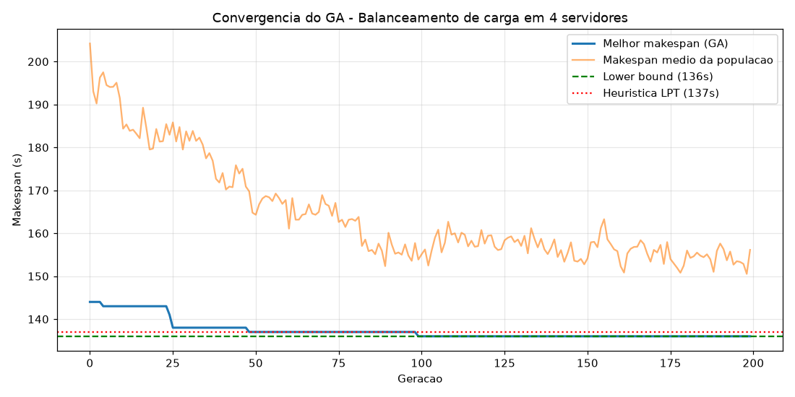
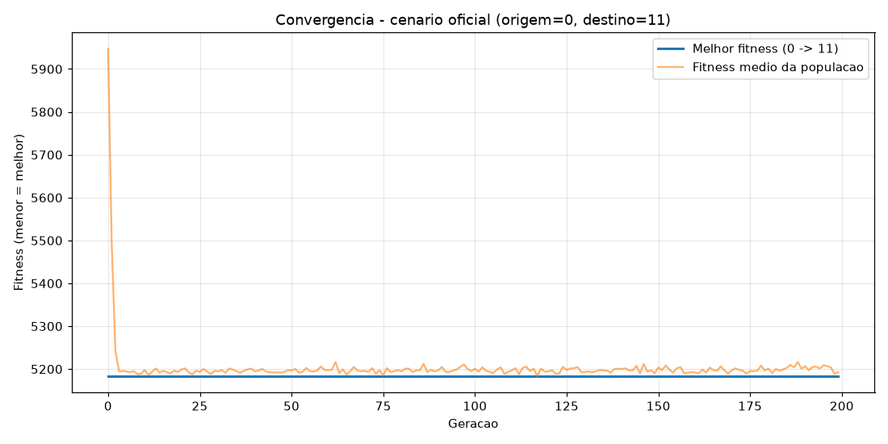

# Resultados — Aula 03 AC-1 (Etapa Final)

## Exercício 1 — Análise do Elitismo na Estabilidade Algorítmica

Código em [exercicio_01_elitismo.py](exercicio_01_elitismo.py). Para isolar o efeito real do elitismo (e não a sorte do sorteio aleatório de uma única rodada), o script roda 20 instâncias independentes do problema (matriz de distâncias + população inicial diferentes a cada vez), testando `USAR_ELITISMO=True` e `False` sobre a mesma instância em cada trial, e registra o **melhor custo de cada geração** (não o melhor acumulado) para deixar visível quando a curva piora de uma geração para a outra.

```
[Exercicio 1] N de instancias testadas: 20
[Exercicio 1] Custo final medio (Elitismo=True) : 227.75 (desvio 29.80)
[Exercicio 1] Custo final medio (Elitismo=False): 232.07 (desvio 36.37)
[Exercicio 1] Regressoes medias por execucao (Elitismo=True) : 0.00 de 79
[Exercicio 1] Regressoes medias por execucao (Elitismo=False): 1.55 de 79
[Exercicio 1] Trials em que Elitismo=True obteve o menor (ou igual) custo final: 15/20

[Exercicio 1] --- Rodada unica de referencia (trial 0, seed=42) ---
[Exercicio 1] Menor Custo Obtido (Elitismo=True) : 198.84
[Exercicio 1] Menor Custo Obtido (Elitismo=False): 181.98
```



### Análise

O número mais revelador aqui **não** é o custo final — é a contagem de regressões: **0 em 79** transições de geração com elitismo, contra **1,55 em média** sem elitismo. Isso confirma exatamente o que a teoria prevê: com elitismo, o melhor indivíduo de uma geração é sempre copiado intacto para a próxima, então o "melhor custo da geração" **nunca pode piorar** — a curva é matematicamente garantida a ser não-crescente. Sem elitismo, mesmo o melhor indivíduo pode ser "perdido" (não ser escolhido nos torneios de reprodução, ou ser destruído por uma mutação no filho gerado a partir dele), e a população pode regredir temporariamente.

O gráfico acima (rodada de referência) mostra isso de forma muito clara: a curva sem elitismo (laranja) encontra uma solução ótima na geração 30 (custo ≈182), **perde essa solução** logo em seguida (volta a ≈235), e só a redescobre de forma estável por volta da geração 55 — pura sorte do sorteio aleatório. A curva com elitismo (azul) converge mais rápido e nunca sofre esse tipo de regresso.

Também é importante notar que, olhando só para essa rodada de referência, a versão *sem* elitismo terminou com um custo final **melhor** (181,98 contra 198,84) — o que poderia enganar alguém a concluir "elitismo é pior". É por isso que rodamos 20 instâncias: em média, com elitismo o custo final é ligeiramente melhor (227,75 vs 232,07) e mais consistente (desvio padrão menor: 29,80 vs 36,37), e o elitismo empata ou vence em 15 das 20 instâncias. **Conclusão:** o elitismo não garante achar o ótimo global mais rápido em toda rodada individual (pode até "prender" a busca perto de um ótimo local ao proteger demais o melhor atual), mas garante **estabilidade** — a qualidade da melhor solução encontrada nunca piora — o que é geralmente preferível em um algoritmo de produção, onde regressões são indesejáveis mesmo que ocasionalmente uma busca "instável" tenha sorte.

---

## Exercício 2 — Inserção de Penalidades por Descumprimento de SLA

Código em [exercicio_02_penalidade_sla.py](exercicio_02_penalidade_sla.py).

```
[Exercicio 2] Custo Total (Com Penalizacoes de SLA): 1160.00 ms

[Exercicio 2] Detalhamento por enlace:
  Enlace 0 -> 1:  18.42 ms | dentro do SLA
  Enlace 1 -> 2:  13.38 ms | dentro do SLA
  Enlace 2 -> 3:  20.79 ms | dentro do SLA
  Enlace 3 -> 4:  62.04 ms | VIOLOU SLA (+1000 ms)
  Enlace 4 -> 5:  45.38 ms | dentro do SLA

[Exercicio 2] Latencia acumulada (sem penalidade): 160.00 ms
[Exercicio 2] Enlaces que violaram o SLA (>50 ms): 1 de 5
[Exercicio 2] Penalidade total aplicada: 1000.00 ms
[Exercicio 2] Custo final (com penalidade): 1160.00 ms
```

### Análise

Na rota de teste `[0,1,2,3,4,5]`, apenas o enlace `3 → 4` (62,04 ms) ultrapassa o limite operacional de 50 ms, acionando uma única penalidade de +1000 ms. O custo bruto da rota (160 ms) é pequeno perto da penalidade (1000 ms) — de propósito: esse desenho faz com que, num algoritmo de busca (GA, por exemplo), qualquer rota com violação de SLA fique automaticamente muito pior do que qualquer rota sem violações, mesmo que a rota "ruim" tivesse uma latência bruta menor. Isso é o que garante que a otimização priorize sempre o cumprimento do contrato de SLA antes de tentar minimizar a latência residual — o mesmo princípio de penalização usado no Exercício 1 (AULA_3) e no código-demonstração desta aula.

---

## Exercício 3 (Desafio de Código) — Balanceamento de Carga em Servidores

Código em [desafio_03_alocacao_servidores.py](desafio_03_alocacao_servidores.py).

**Representação:** vetor de 20 posições com inteiros em `[0,3]` — índice = tarefa, valor = servidor. Como a ordem do vetor não importa aqui (diferente do TSP), o crossover usado foi o **uniforme** (gene a gene, 50/50 entre os pais) em vez do OX, e a mutação reatribui aleatoriamente o servidor de uma tarefa.

```
Soma total dos tempos: 541 s
Limite inferior teorico (lower bound): 136 s
Makespan da heuristica LPT: 137 s
Makespan encontrado pelo GA: 136 s
Gap do GA em relacao ao lower bound: 0 s (0.0%)

Alocacao final (GA) -- tarefa -> servidor:
  Servidor 0: tarefas [0, 7, 12, 19] | tempos [12, 45, 50, 29] | carga total = 136 s
  Servidor 1: tarefas [3, 11, 14, 15, 16] | tempos [8, 28, 25, 33, 42] | carga total = 136 s
  Servidor 2: tarefas [1, 5, 6, 8] | tempos [35, 22, 19, 60] | carga total = 136 s
  Servidor 3: tarefas [2, 4, 9, 10, 13, 17, 18] | tempos [40, 15, 31, 14, 18, 10, 5] | carga total = 133 s
```



### Análise

O limite inferior teórico é `max(⌈soma/4⌉, maior tarefa individual) = max(136, 60) = 136 s` — ou seja, mesmo com a distribuição mais equilibrada matematicamente possível, nenhum servidor pode ficar com menos de 136s de carga. O GA **atingiu exatamente esse limite** (136s, gap de 0%), superando a heurística gulosa clássica LPT (Longest Processing Time first), que ficou em 137s. Isso mostra o valor de uma busca populacional sobre uma heurística construtiva de passo único: o LPT toma decisões gulosas irreversíveis (uma vez atribuída, uma tarefa nunca é realocada), enquanto o GA consegue explorar recombinações de atribuições completas e escapar de mínimos locais que prendem a heurística gulosa.

---

## Desafio de Fechamento — Motor de Decisioning SD-WAN Zero-Trust

Código em [desafio_ac1_master_sdwan.py](desafio_ac1_master_sdwan.py). O relatório técnico completo está no cabeçalho do arquivo; resumo abaixo.

**Modelagem:** rede de 12 nós em malha completa (full-mesh overlay, como é típico numa SD-WAN — qualquer site alcança qualquer outro via túneis sobre a internet pública). Latência e perda de pacotes são atributos de **enlace** (matrizes 12×12); reputação de segurança é atributo de **nó** (vetor de 12 posições). Representação do indivíduo: par `(perm, k)` — uma permutação dos nós intermediários e quantos deles (`k`) realmente entram na rota — permitindo rotas de **tamanho variável**, do salto direto até passar por todos os nós, e possibilitando desviar de nós inseguros sem ser obrigado a visitá-los (diferente de uma permutação fixa estilo TSP).

```
Nos nao confiaveis na topologia (reputacao < 50): [1, 2, 6, 8, 11]
Reputacao de cada no nao confiavel: [(1, 1.9), (2, 15.2), (6, 38.5), (8, 30.1), (11, 0.2)]

Rota selecionada (0 -> 11): [0, 11]
  Latencia total : 37.36 ms
  Perda total    : 7.31 %
  Penalidade     : 5000.00  (inevitavel: destino 11 e nao confiavel)
  Fitness final  : 5183.61
```



### Achado central: um caso-limite genuíno, não um bug

Com a semente obrigatória `np.random.seed(2026)`, o próprio **nó de destino (11)** caiu na faixa não confiável (reputação 0,2). Como a rota é obrigada a terminar no nó 11, **toda e qualquer rota possível aciona a penalidade de segurança** — não existe "desvio" que evite isso, porque o nó problemático não é um nó de passagem, é o destino em si. Validei por força bruta (testando todas as rotas com até 1 nó intermediário) que a rota direta `[0,11]` é de fato a de menor custo de desempenho entre todas as alternativas — ou seja, dado que a penalidade já é inevitável, o motor corretamente para de "gastar" latência/perda extra tentando (inutilmente) evitar nós inseguros, e escolhe o caminho mais rápido possível.

**Leitura de segurança:** quando o risco está no próprio destino obrigatório, a mitigação não pode vir da escolha de rota — precisa vir de outra camada de controle (inspeção inline, microssegmentação, autenticação reforçada na aplicação daquele site). Roteamento zero-trust protege contra nós de **passagem** inseguros; não protege contra o próprio destino.

### Comprovando que o mecanismo de desvio funciona (anexo, nós 3→4)

Para não deixar a alegação "o motor desvia de nós inseguros" sem demonstração, rodei um segundo cenário na mesma rede/semente, com origem e destino **confiáveis** (nó 3, reputação 50,5, e nó 4, reputação 86,4):

```
Rota SEM considerar seguranca (melhor desempenho puro): [3, 6, 4]
  Latencia+perda ponderadas: 139.70 | acionaria a penalidade? SIM
Rota COM seguranca (motor zero-trust): [3, 7, 4]
  Latencia+perda ponderadas: 159.92 | penalidade: 0.00
  Custo extra pago para eliminar o risco: 20.22 (14.5% mais lento/instavel)
```

Aqui a rota mais rápida (via nó 6, reputação 38,5) foi corretamente rejeitada pelo motor com segurança ativada, que escolheu em vez disso a rota via nó 7 (reputação 92,4) — pagando 14,5% a mais de latência/perda ponderada para eliminar completamente o risco de interceptação. Esse é exatamente o comportamento esperado de um roteador zero-trust: sacrificar desempenho marginal em troca de nunca atravessar um nó não confiável, sempre que a topologia permitir essa escolha.

---

## Arquivos desta entrega

| Arquivo | Conteúdo |
|---|---|
| `exercicio_01_elitismo.py` | Exercício 1 — comparação com/sem elitismo (20 instâncias) |
| `exercicio_02_penalidade_sla.py` | Exercício 2 — penalidade de SLA |
| `desafio_03_alocacao_servidores.py` | Exercício 3 — GA de balanceamento de carga |
| `desafio_ac1_master_sdwan.py` | Desafio de fechamento — motor SD-WAN zero-trust |
| `img_exercicio01_elitismo.png` | Gráfico de convergência do Exercício 1 |
| `img_exercicio03_balanceamento.png` | Gráfico de convergência do Exercício 3 |
| `img_desafio_ac1_convergencia.png` | Gráfico de convergência do desafio final |
