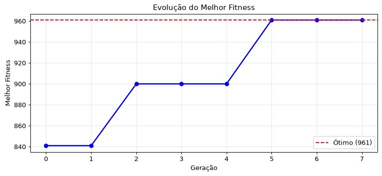
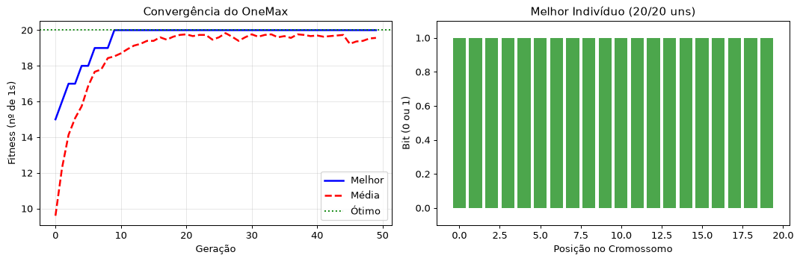
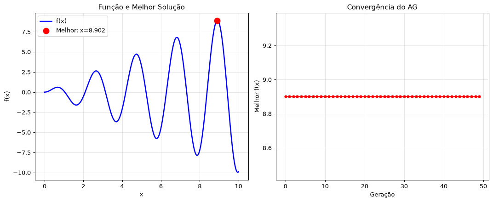

# Resultados — Aula 03 (Algoritmos Genéticos)

## Lab 1 — Demonstração: maximizar f(x) = x² em [0, 31]

```
==================================================
ALGORITMO GENÉTICO PASSO A PASSO
==================================================

População inicial: [[0, 1, 1, 1, 1], [0, 1, 0, 0, 1], [0, 1, 1, 1, 1], [0, 0, 0, 0, 0], [1, 1, 1, 0, 1], [1, 0, 1, 0, 0]]

==================== GERAÇÃO 0 ====================

Avaliação dos indivíduos:
  [0, 1, 1, 1, 1] → x=15 → f(x)=225
  [0, 1, 0, 0, 1] → x= 9 → f(x)= 81
  [0, 1, 1, 1, 1] → x=15 → f(x)=225
  [0, 0, 0, 0, 0] → x= 0 → f(x)=  0
  [1, 1, 1, 0, 1] → x=29 → f(x)=841
  [1, 0, 1, 0, 0] → x=20 → f(x)=400

 Melhor: x = 29 → f(x) = 841

==================== GERAÇÃO 1 ====================
 Melhor: x = 29 → f(x) = 841

==================== GERAÇÃO 2 ====================
 Melhor: x = 30 → f(x) = 900

==================== GERAÇÃO 3 ====================
 Melhor: x = 30 → f(x) = 900

==================== GERAÇÃO 4 ====================
 Melhor: x = 30 → f(x) = 900

==================== GERAÇÃO 5 ====================
 Melhor: x = 31 → f(x) = 961

==================== GERAÇÃO 6 ====================
 Melhor: x = 31 → f(x) = 961

==================== GERAÇÃO 7 ====================
 Melhor: x = 31 → f(x) = 961

==================================================
RESULTADO FINAL
==================================================

Melhor indivíduo: [1, 1, 1, 1, 1]
x = 31
f(x) = 961

Ótimo global: x = 31, f(x) = 961
Erro: 0
```



> Saída completa (todas as 8 gerações, indivíduo a indivíduo) disponível em [lab01_aula03.ipynb](lab01_aula03.ipynb).

### Considerações

Com uma população pequena (6 indivíduos) e poucos bits (5, ou seja, apenas 32 valores possíveis de x), o AG já converge muito rápido: o ótimo global (x = 31, f(x) = 961) foi encontrado na geração 5 de 8 e se manteve até o fim por causa do elitismo (o melhor indivíduo de cada geração é sempre copiado para a próxima). Dá para ver claramente os 4 passos do algoritmo acontecendo a cada geração: a população é avaliada, o melhor é preservado, e o resto é gerado por seleção por roleta + crossover + mutação — a população vai ficando dominada por variações do indivíduo `[1,1,1,0,1]` (x=29) até a mutação por acaso "ligar" o último bit e chegar em `[1,1,1,1,1]` (x=31). Como o espaço de busca aqui é pequeno (32 soluções), seria até possível achar o ótimo por força bruta, mas o exemplo serve para visualizar o comportamento do AG num caso simples antes de ir para problemas maiores.

---

## Lab 2 — Atividade 2: OneMax (maximizar número de 1s)

```
==================================================
ONEMAX - AG com 30 indivíduos, 50 gerações
==================================================
Geração   0: Melhor = 15/20, Média = 9.60
Geração  10: Melhor = 20/20, Média = 18.70
Geração  20: Melhor = 20/20, Média = 19.77
Geração  30: Melhor = 20/20, Média = 19.77
Geração  40: Melhor = 20/20, Média = 19.70

 MELHOR FITNESS: 20/20
   Ótimo = 20 (todos os bits são 1)
```



### Considerações

O OneMax é o problema mais simples possível para um AG (cada bit contribui de forma independente para o fitness), e isso aparece no resultado: o algoritmo já atinge o ótimo (20/20) antes da geração 10, bem mais rápido que os "~85 uns depois de 50 gerações" citados como exemplo típico no material teórico — porque aqui o cromossomo é bem menor (20 bits, contra 100 no exemplo do PDF). Depois de atingir o ótimo, o fitness médio da população oscila logo abaixo do máximo (entre 18,7 e 19,8) em vez de estabilizar em 20 — isso é esperado, porque a mutação (2% por bit) continua "estragando" algumas cópias mesmo depois de a melhor solução já ter sido encontrada; é o elitismo (guardar sempre os 2 melhores) que garante que o melhor valor encontrado nunca piora. Isso ilustra bem o motivo de a mutação ser uma taxa baixa: ela ajuda a explorar no início, mas se fosse muito alta atrapalharia a convergência no fim.

---

## Lab 3 — Atividade 3: maximizar f(x) = x·sin(3x) em [0, 10]

Código semi-pronto completado com as 3 funções que faltavam (`bits_para_x`, `fitness` e `mutacao`), implementação em [lab03_aula03_CIAO.py](lab03_aula03_CIAO.py).

```
==================================================
OTIMIZANDO f(x) = x * sin(3x)
==================================================
Geração   0: Melhor f(x) = 8.9019 (x = 8.9020)
Geração  10: Melhor f(x) = 8.9019 (x = 8.9020)
Geração  20: Melhor f(x) = 8.9019 (x = 8.9020)
Geração  30: Melhor f(x) = 8.9019 (x = 8.9020)
Geração  40: Melhor f(x) = 8.9019 (x = 8.9020)

 MELHOR SOLUÇÃO: x = 8.9020, f(x) = 8.9019
```



### Considerações

O máximo global real de f(x) = x·sin(3x) em [0, 10] fica em x ≈ 8,9136, com f(x) ≈ 8,9074 (calculado por varredura numérica fina, fora do AG). O AG encontrou x = 8,9020, f(x) = 8,9019 — uma diferença de apenas ~0,0055 no valor de f(x). Isso não é por acaso: com 8 bits, só existem 2⁸ = 256 valores de x representáveis no intervalo [0, 10], então a resolução do problema é 10/255 ≈ 0,0392. O ponto representável mais próximo do ótimo real (8,9136) é justamente x = 8,9020 — ou seja, o AG achou a **melhor solução possível dentro da precisão que a própria representação binária permite**. Isso mostra bem uma limitação importante da codificação binária para números reais: o erro de aproximação (chamado "erro de quantização") existe mesmo que o algoritmo de busca funcione perfeitamente, e só diminui aumentando o número de bits (o que, por sua vez, aumenta o espaço de busca 2ⁿ). O gráfico da direita também mostra que o AG converge muito rápido para essa solução (antes da geração 10), sinal de que a função, apesar de ter vários máximos locais visíveis à esquerda, não é difícil o suficiente para "enganar" o algoritmo com essa configuração de parâmetros.
