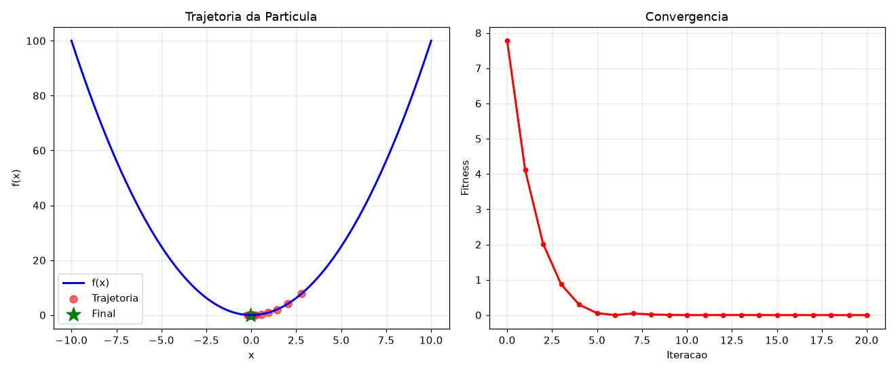
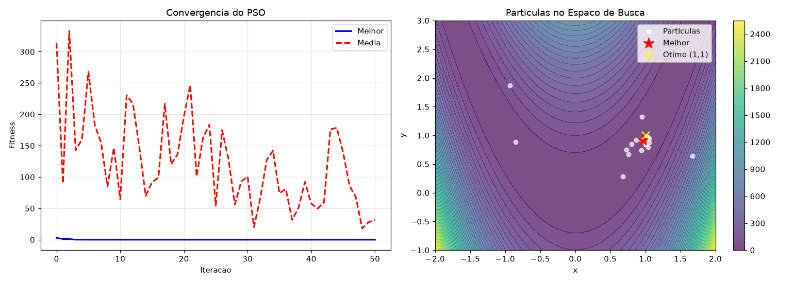
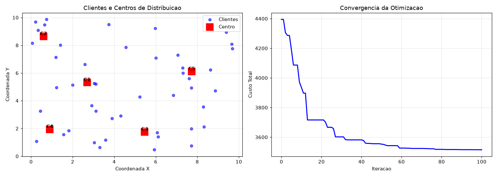
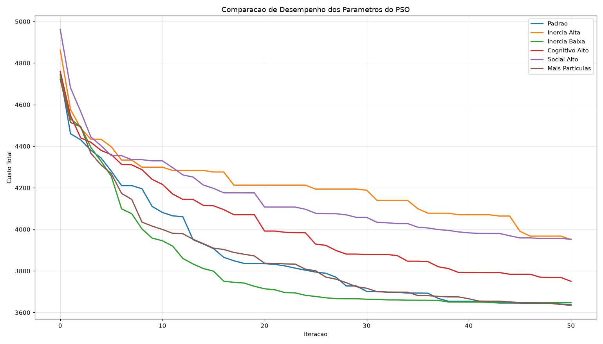

# Resultados — Aula 05 (PSO — Particle Swarm Optimization)

AC-2 Parte 1. Código completo em [lab_aula05_CIAO.py](lab_aula05_CIAO.py) / [lab_aula05_CIAO.ipynb](lab_aula05_CIAO.ipynb) (uma célula de definições + uma célula por missão, executadas de verdade — nada nesta página foi inventado).

---

## Correção importante encontrada (Missões 3 e 4)

O código-base fornecido no roteiro tinha a função `fitness()` retornando `-custo_total`, comentada como "(maximização)". Só que o laço do PSO em todo o resto do roteiro sempre busca o **menor** fitness (`if fitness < gBest_fit`). Isso significa que, do jeito que estava escrito, o algoritmo estava **maximizando** o custo de entrega — o oposto do objetivo da missão ("minimizar o custo total").

Percebi isso porque, rodando o código exatamente como estava, os 5 centros colapsavam nos cantos do mapa (custo final ≈ 17000), enquanto uma distribuição fixa e ingênua de 5 centros (sem nenhuma otimização) já alcança ≈ 4875 de custo. Um resultado "otimizado" pior que uma tentativa aleatória de bom senso é sinal claro de bug. A correção foi simples: `fitness()` passa a devolver `custo_total` diretamente (sem o sinal negativo), mantendo a convenção "menor é melhor" usada em todo o resto do código. Depois da correção, os centros ficaram bem distribuídos entre os clientes e o custo caiu para ≈ 3515 — ver Missão 3 abaixo.

---

## Missão 1 — A Partícula Solitária

```
Posicao inicial: 2.7885
Fitness inicial: 7.7759
...
Iteracao  6: pos = -0.0153, fitness =   0.0002
...
Iteracao 20: pos = -0.0273, fitness =   0.0007

RESULTADO FINAL
Posicao final: -0.027285
Fitness final: 0.000744
Otimo global: x = 0.000000, f(x) = 0.000000
Erro: 0.027285
```



**Análise:** a partícula praticamente encontrou o mínimo — já estava a 0,0002 de distância do ótimo na iteração 6, mas continuou oscilando de leve em torno de zero pelas iterações seguintes (comportamento de "oscilador amortecido": como é a única partícula, `pBest` e `gBest` são sempre o mesmo ponto, então ela vai e volta em torno da própria melhor memória em vez de convergir suavemente). Terminou com erro de apenas 0,027 — para fins práticos, encontrou o mínimo.

---

## Missão 2 — O Enxame de Partículas (Rosenbrock)

```
Inicio: Melhor fitness = 2.923820
Iteracao 10: Melhor = 0.005174
Iteracao 20: Melhor = 0.002043
Iteracao 30: Melhor = 0.002043
Iteracao 40: Melhor = 0.001536
Iteracao 50: Melhor = 0.001518

Fim: Melhor fitness = 0.001518
Otimo global: f(1,1) = 0.000000
```



**Análise:** o enxame de 20 partículas chegou a 0,0015 do ótimo (função de Rosenbrock, que tem um vale estreito e curvo — bem mais difícil que a parábola da Missão 1) em apenas 50 iterações. O gráfico da esquerda mostra algo importante: a linha do **melhor** fitness (azul) cai rápido e fica estável perto de zero, enquanto o fitness **médio** da população (vermelho) continua oscilando bastante até o fim. Isso mostra a cooperação do PSO na prática: mesmo com várias partículas "perdidas" explorando o vale (média alta e instável), basta que UMA encontre um bom ponto para que o `gBest` — e por consequência todo o enxame, através do termo social — seja puxado para perto do ótimo.

---

## Missão 3 — Otimização Logística

```
DADOS DO PROBLEMA:
   - 50 clientes
   - 5 centros de distribuicao
   - Demanda media: 51.0 unidades

Iteracao  20: Custo = 3716.12
Iteracao  40: Custo = 3581.58
Iteracao  60: Custo = 3526.28
Iteracao  80: Custo = 3517.56
Iteracao 100: Custo = 3514.93

RESULTADO FINAL:
   Tempo de execucao: 1.87 segundos
   Custo total: 3514.93
   Melhor custo possivel: 0.00
   Centros de distribuicao:
      Centro 1: (2.70, 5.32)
      Centro 2: (0.59, 8.65)
      Centro 3: (5.47, 1.76)
      Centro 4: (0.90, 1.94)
      Centro 5: (7.74, 6.12)
```



**Análise:** depois da correção do sinal (ver acima), o resultado faz sentido: os 5 centros se espalharam para ficar perto dos aglomerados de clientes (mapa à esquerda), e o custo caiu de forma consistente e monotônica ao longo das 100 iterações (gráfico à direita), saindo de ≈4400 (posições aleatórias iniciais) para 3514,93. Como comparação, uma grade fixa "ingênua" de 5 centros (sem otimização nenhuma) fica em ≈4875 — ou seja, o PSO efetivamente encontrou uma solução melhor que uma tentativa razoável feita à mão.

---

## Missão 4 — Otimização dos Parâmetros do PSO

```
| Experimento        | Custo Medio | Melhor Custo | Pior Custo  |
|--------------------|-------------|--------------|-------------|
| Padrao             |    3638.88 |      3547.08 |     3712.66 |
| Inercia Alta       |    3951.15 |      3772.40 |     4145.73 |
| Inercia Baixa      |    3647.04 |      3514.29 |     3797.89 |
| Cognitivo Alto     |    3750.04 |      3671.45 |     3808.38 |
| Social Alto        |    3952.36 |      3890.59 |     4051.99 |
| Mais Particulas    |    3635.02 |      3523.28 |     3677.28 |

1. Qual configuracao obteve o MELHOR resultado?
   -> Mais Particulas
2. Qual configuracao obteve o PIOR resultado?
   -> Social Alto
```



### Análise (respondendo às perguntas do roteiro)

**Inércia (w):** subir de 0,7 para 0,9 (Inércia Alta) piorou bastante o resultado (3951 vs 3639 do padrão) — mais inércia faz as partículas manterem mais "impulso" da velocidade anterior, overshooting e demorando mais para se estabilizar nas 50 iterações disponíveis. Baixar para 0,5 teve efeito pequeno (3647, praticamente igual ao padrão) — neste problema, menos inércia não atrapalhou, sinal de que 0,7 já não estava "sobrando" impulso.

**Cognitivo (c1):** subir para 2,5 piorou moderadamente (3750 vs 3639). Com mais peso na própria memória, cada partícula "teimra" mais em voltar ao seu próprio melhor ponto, o que reduz a influência do aprendizado coletivo e atrasa a convergência do grupo como um todo.

**Social (c2):** subir para 2,5 foi o **pior resultado de todos os experimentos** (3952). Com atração social dominante, as partículas se aglomeram cedo demais em torno do `gBest` atual — que nas primeiras iterações ainda não é um bom ponto — perdendo diversidade de busca e ficando presas perto de um ótimo local antes de explorar o espaço de verdade (convergência prematura).

**Número de partículas:** dobrar para 60 (mantendo os demais parâmetros) deu o **melhor resultado médio** (3635) e também um desvio padrão baixo (57,41, o segundo mais consistente). Faz sentido: mais partículas cobrem melhor o espaço de busca logo nas primeiras iterações, aumentando a chance de alguma começar perto de uma boa região. O custo é computacional — cada iteração fica duas vezes mais cara para avaliar.

**Configuração recomendada para este problema:** `w=0.7, c1=1.8, c2=1.8, partículas=60` ("Mais Partículas"). Foi a melhor média entre as 6 configurações testadas, com boa consistência entre execuções. Em um cenário com restrição forte de tempo de execução, a configuração "Padrão" (30 partículas) é uma alternativa quase tão boa (3639 vs 3635) a um custo computacional bem menor.

---

## Relatório Final PSO

### Parte 1: O que você aprendeu?

**1. O que é o PSO e como funciona:**
O PSO (Particle Swarm Optimization / Otimização por Enxame de Partículas) é um algoritmo de busca inspirado no comportamento coletivo de bandos de pássaros ou cardumes. Ao contrário do Algoritmo Genético (que evolui uma população através de gerações, com seleção, cruzamento e mutação — indivíduos "morrem" e "nascem"), no PSO as partículas nunca morrem: elas navegam continuamente pelo espaço de busca, ajustando sua velocidade a cada iteração com base em três forças — inércia (tendência de continuar na mesma direção), componente cognitivo (atração pela própria melhor posição já visitada) e componente social (atração pela melhor posição já visitada por qualquer partícula do enxame). A posição de cada partícula é somada à sua velocidade a cada passo, e o processo se repete até convergir.

**2. Diferença entre pBest e gBest, e por que ambos importam:**
`pBest` é a melhor posição que **aquela partícula em particular** já visitou — é a "memória pessoal" dela. `gBest` é a melhor posição encontrada por **qualquer partícula do enxame inteiro** até o momento — é o "conhecimento coletivo" do grupo. Os dois são importantes porque equilibram exploração e explotação: se só existisse `pBest` (como na Missão 1, com uma única partícula), cada partícula ficaria "presa" refinando a própria experiência, sem se beneficiar do que as outras descobriram — a busca fica lenta e pode nunca escapar de uma região ruim. Se só existisse `gBest`, todas as partículas convergiriam cedo demais para o mesmo ponto (o que vimos na Missão 4 com o parâmetro social alto), perdendo diversidade de busca. É o equilíbrio entre os dois que faz o enxame explorar o espaço de forma ampla no início e convergir de forma coordenada no final.

### Parte 2: Experiência com as missões

**Missão 1 — A Partícula Solitária:**
- A partícula encontrou o mínimo? **(X) Sim** (erro final de 0,027 — praticamente zero para fins práticos)
- Quantas iterações foram necessárias? **~6** para chegar bem perto (fitness 0,0002); continuou oscilando de forma decrescente até a 20ª
- Dificuldade: **( X ) Fácil** — os 2 TODOs eram a fórmula direta do PSO já dada no enunciado

**Missão 2 — O Enxame:**
- O enxame encontrou o mínimo global? **(X) Sim** (fitness final 0,0015, muito próximo de f(1,1)=0)
- Comparado com a Missão 1: o enxame foi mais rápido? **(X) Sim** — resolveu um problema mais difícil (Rosenbrock, com vale estreito e curvo) em 50 iterações com uma precisão ainda melhor que a Missão 1 obteve num problema mais simples, graças à comunicação social entre partículas
- Dificuldade: **( X ) Médio** — mais TODOs, estrutura de dicionário por partícula, e limites por dimensão diferentes em x e y

**Missão 3 — Problema Corporativo:**
- Comparado com o custo inicial: melhorou? **(X) Sim** — de ≈4400 (posições aleatórias) para 3514,93 (queda de ≈20%)
- Quantos centros foram alocados? **5** (conforme especificado), todos em posições distintas e bem distribuídas entre os clusters de clientes
- Dificuldade: **( X ) Difícil** — 7 TODOs, versão de 10 dimensões, e ainda precisei encontrar e corrigir o bug de sinal na função fitness (ver seção de correção no topo deste documento)

**Missão 4 — Otimização de Parâmetros:**
- Melhor configuração encontrada: **w=0.7, c1=1.8, c2=1.8, partículas=60**
- Pior configuração encontrada: **w=0.7, c1=1.8, c2=2.5, partículas=30** (social alto)
- Dificuldade: **( X ) Fácil** — código já pronto, o trabalho foi rodar, tabular e interpretar os resultados
