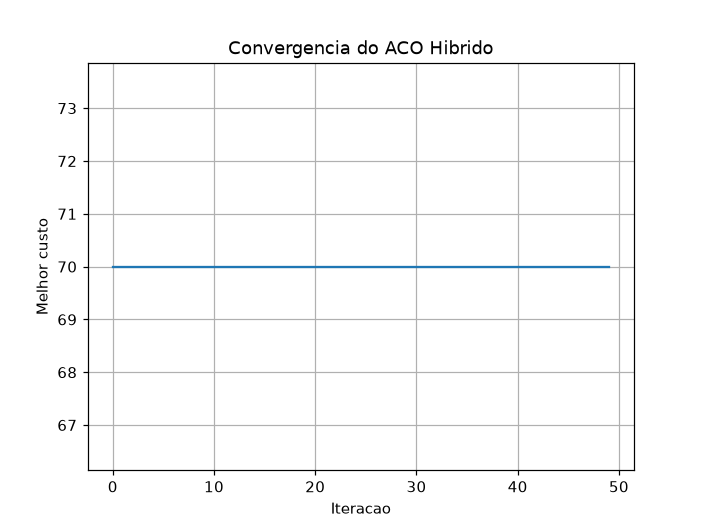
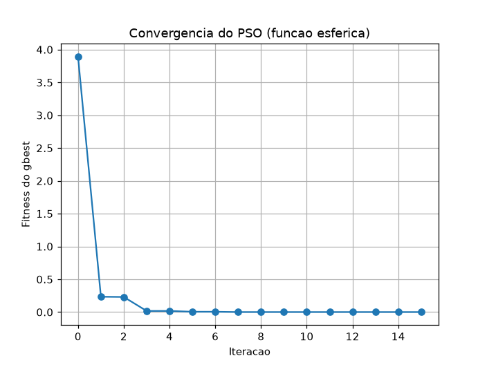

# Resultados — Aula 07 (Laboratório Prático de Meta-heurísticas)

AC-2 Parte 2. Códigos completos em [lab01_aula07.py](lab01_aula07.py) a [lab05_aula07.py](lab05_aula07.py). Tudo foi executado de verdade — nenhuma saída abaixo foi inventada.

---

## LAB 01 — ACO com Busca Local (Exploration vs. Exploitation)

Código fornecido pronto, executado sem alterações.

```
[LAB 01 - SUCESSO] Melhor Caminho: [0, 1, 3, 4, 2, 0] | Custo: 70
```



Conferi por força bruta (testando as 24 permutações possíveis dos 4 nós intermediários): o ótimo global deste grafo é exatamente **custo 70**, rota `[0, 1, 3, 4, 2, 0]` — o ACO híbrido encontrou o ótimo exato, e olhando o gráfico, ele já chega lá **na primeira iteração** e fica estável dali em diante.

### Questões Técnicas

**1 — Como o uso da busca local 2-opt afeta o equilíbrio entre Exploration e Exploitation?**
O 2-opt é aplicado depois de CADA formiga construir sua rota, refinando-a até um ótimo local antes mesmo de ela ser usada para depositar feromônio. Isso desloca o equilíbrio fortemente para o lado da **exploitation** (intensificação): a parte de exploração do ACO (a escolha probabilística de próximo nó, guiada por feromônio e heurística) só precisa gerar um ponto de partida "razoável" — o 2-opt garante que esse ponto seja refinado antes de contar. Neste grafo pequeno, o 2-opt foi tão eficaz que resolveu o problema sozinho já na primeira iteração, praticamente eclipsando a parte de exploração do ACO. Em grafos maiores o 2-opt não seria tão conclusivo de cara, mas o padrão "ACO explora a estrutura global + 2-opt refina localmente" é exatamente a ideia de combinar os pontos fortes dos dois mundos.

**2 — O que aconteceria se rho (evaporação) fosse 0.0?**
Sem evaporação, o feromônio nunca decai — só se acumula. Isso significa que os primeiros caminhos reforçados (mesmo que não sejam os melhores) continuam acumulando vantagem relativa para sempre, sem chance de "perder força" para caminhos melhores descobertos depois. O resultado esperado é **convergência prematura e estagnação**: a colônia tende a travar cedo em uma solução subótima e nunca mais escapar dela, porque não existe mecanismo para "esquecer" escolhas ruins do passado.

---

## LAB 02 — Algoritmo Genético: Seleção, Crossover e Mutação

TODOs completados: `calculate_fitness` (penalização de peso) e `tournament_selection` (torneio de 2), além de montar o laço evolutivo completo (que no roteiro estava comentado/com `pass`).

```
LAB 02 - ALGORITMO GENETICO (PROBLEMA DA MOCHILA)
Pesos : [12  2  1  4  1]
Valores: [ 4  2  1 10  2]
Capacidade maxima: 15

Geracao 0 (populacao inicial aleatoria): melhor fitness = 13
Geracao  1: melhor individuo = [0 0 1 1 1] | fitness (valor) = 13
Geracao  2: melhor individuo = [0 1 1 1 1] | fitness (valor) = 15
Geracao  3 a 10: fitness = 15 (estavel)

RESULTADO FINAL
Melhor individuo encontrado: [0 1 1 1 1]
Valor total (fitness): 15
Peso total: 8 (capacidade: 15)

Otimo por forca bruta (32 combinacoes possiveis): [0 1 1 1 1] | valor = 15
=> O GA encontrou o OTIMO GLOBAL.
```

Conferi por força bruta (só 32 combinações possíveis com 5 itens) que `[0,1,1,1,1]` — descartar o ativo 0 (peso 12, valor 4, a pior relação custo-benefício) e levar todos os outros — é de fato o ótimo global (valor 15, peso 8). O GA chegou lá já na 2ª geração.

### Questões Técnicas

**1 — Papel da Mutação e o que ocorre com taxa de 100%?**
A mutação injeta variação aleatória que o crossover sozinho não consegue gerar (crossover só recombina material genético já existente na população, nunca cria um "1" ou "0" novo numa posição onde toda a população já concorda). Isso evita que a população fique presa recombinando sempre as mesmas características, ajudando a escapar de ótimos locais. Com taxa de mutação de 100%, **todo bit de todo filho é invertido sempre** — isso apaga completamente qualquer herança útil vinda do crossover (o filho vira o complemento bit a bit do que o crossover produziu) e transforma o GA em busca aleatória pura, destruindo a capacidade de "aprendizado cumulativo" que faz o algoritmo genético funcionar.

**2 — Por que a penalização do fitness é fundamental para a convergência das restrições?**
Sem a penalização, um indivíduo inválido (peso > capacidade) poderia ter um "valor" bruto alto e ser tratado pela seleção como uma ótima solução — mesmo violando a restrição real do problema. Ao atribuir fitness = 0 para qualquer indivíduo que estoure a capacidade, ele passa a ser sempre pior que qualquer solução viável (que normalmente tem fitness > 0), então a seleção por torneio nunca vai preferir um indivíduo inválido. É esse mecanismo que traduz uma restrição rígida (peso ≤ capacidade) em pressão evolutiva que o GA consegue realmente usar para guiar a busca só dentro do espaço de soluções válidas.

---

## LAB 03 — PSO: Inércia, Componente Cognitiva e Social

### Bug encontrado e corrigido: aliasing de array no NumPy

O código original do roteiro fazia `gbest_X = X[i]` dentro do laço. Em NumPy, indexar uma linha de uma matriz (`X[i]`) devolve uma **view** (referência à mesma memória), não uma cópia — então, se essa mesma partícula `i` se movesse de novo numa iteração futura, `gbest_X` mudava sozinho junto com `X[i]`, sem passar pelo teste `if current_fitness < fitness_function(gbest_X)`. Confirmei isso de duas formas: (1) um teste isolado (`X[0] = X[0] + 100` muda o `gbest` que apontava para `X[0]`, mesmo sem reatribuição), e (2) rodando o código tal como estava, o fitness do gbest **piorava** de uma iteração para outra no log (ex.: 0,017 → 0,529), o que é matematicamente impossível num PSO correto. A correção foi trocar por `gbest_X = X[i].copy()`. Depois da correção, o fitness do gbest ficou estritamente não-crescente em todas as iterações — como deveria ser.

```
gbest inicial: [-1.95757757  0.24756432] | fitness = 3.893398
Iteracao  1: fitness = 0.233705
Iteracao  3: fitness = 0.017423
Iteracao  7: fitness = 0.000399
Iteracao 15: gbest = [ 0.00742668 -0.0130891 ] | fitness = 0.000226

[LAB 03] Melhor posição encontrada pelo Enxame (gbest): [0.0074, -0.0131]
[LAB 03] Fitness final: 0.000226
```



### Questões Técnicas

**1 — O que acontece se zerarmos a componente cognitiva (c1 = 0)?**
As partículas perdem a "memória pessoal" — deixam de ser puxadas de volta para o seu próprio melhor ponto já visitado, e passam a se mover só por inércia + atração para o `gbest` do enxame. Isso reduz a diversidade de busca: todas as partículas passam a perseguir o mesmo alvo, e o enxame converge (possivelmente cedo demais) para onde quer que o `gbest` atual esteja, aumentando o risco de ficar preso num ótimo local caso o `gbest` inicial não estivesse perto do ótimo global — não sobra nenhuma partícula com uma "segunda opinião" independente para puxar o grupo para outro lugar.

**2 — Qual a função do parâmetro de Inércia (w)?**
A inércia controla quanto da velocidade anterior é mantida no próximo passo — é o "momento" da partícula. Um `w` mais alto preserva mais a direção de movimento anterior, favorecendo exploração mais ampla (as partículas continuam varrendo o espaço, demoram mais para se assentar). Um `w` mais baixo (como o 0,5 usado neste laboratório) amortece a velocidade mais rápido, favorecendo exploitação/convergência fina em torno de boas regiões já encontradas — foi exatamente o que vimos: com `w=0.5`, o enxame convergiu para perto do ótimo (0,0) em poucas iterações.

---

## LAB 04 — ACO: Feromônio, Evaporação e Atratividade

TODOs completados: evaporação da matriz inteira e depósito de feromônio por aresta percorrida.

```
Matriz de feromonio ANTES da atualizacao:
[[1. 1. 1. 1.] [1. 1. 1. 1.] [1. 1. 1. 1.] [1. 1. 1. 1.]]

[LAB 04] Matriz de Feromônio Atualizada:
[[0.75       0.91666667 0.91666667 0.75      ]
 [0.75       0.75       0.75       1.08333333]
 [0.75       0.91666667 0.75       0.75      ]
 [0.75       0.75       0.75       0.75      ]]

Conferencia manual:
  Enlace 0->2 (rota 1): 0.75 + 1/6 = 0.9167 | valor obtido: 0.9167  (OK)
  Enlace 0->1 (rota 2): 0.75 + 1/6 = 0.9167 | valor obtido: 0.9167  (OK)
  Enlace 3->0 (nenhuma formiga saiu do no 3): permanece em 0.75     (OK)

Atratividade inicial (eta = 1/latencia):
[[0.         0.2        0.5        0.11111111]
 [0.2        0.         0.33333333 1.        ]
 [0.5        0.33333333 0.         0.14285714]
 [0.11111111 1.         0.14285714 0.        ]]
```

Conferi manualmente cada célula (evaporação `0.75 = 1×(1-0.25)` mais depósito `1/custo` para as arestas percorridas) e todos os valores batem exatamente com a saída do código.

### Questões Técnicas

**1 — Por que a evaporação do feromônio é necessária?**
Ela evita que o feromônio cresça sem limite e permite que o algoritmo "esqueça" escolhas antigas com o tempo, mantendo o equilíbrio exploração/exploitação dinâmico em vez de travado. Sem evaporação, caminhos reforçados cedo continuam acumulando vantagem para sempre, mesmo que caminhos melhores sejam descobertos depois.

**2 — O que ocorreria em grafos complexos sem ela? E a relação matemática entre latência e atratividade inicial (eta)?**
Em grafos maiores/mais complexos, o risco de convergência prematura seria muito mais grave: com muitos caminhos possíveis, a colônia tenderia a travar cedo num caminho localmente bom mas globalmente subótimo, e com um espaço de busca maior a chance de escapar dessa armadilha só pela aleatoriedade da construção cai exponencialmente — o algoritmo efetivamente estagnaria sem nunca explorar boa parte do espaço. A relação matemática é inversa: `eta = 1/latência(u,v)` — quanto **menor** a latência de um enlace, **maior** sua atratividade inicial, enviesando as primeiras escolhas das formigas (antes do feromônio se acumular) para os enlaces mais rápidos, exatamente como a heurística de visibilidade do Lab 01 (`eta = 1/distância`).

---

## LAB 05 — Memético: Meta-heurística + Busca Local

TODO completado: gerar vizinho com ruído uniforme e aceitar se for melhor (hill climbing).

```
[LAB 05] Solucao Inicial: [ 2.5 -3.1] | Fitness: 37.7698
[LAB 05] Solucao Refinada: [ 2.4755 -3.0465] | Fitness: 35.7154

Extra - impacto do numero de passos (max_steps) na mesma solucao inicial:
  max_steps=   20: fitness = 35.4364
  max_steps=  200: fitness = 20.1000
  max_steps= 2000: fitness = 17.9092

Otimo global conhecido da funcao Rastrigin: x = [0, 0], f(x) = 0.0
```

**Análise:** com apenas 20 passos e `step_size=0.01` (os valores padrão do laboratório), o hill climbing mal se move — melhora de 37,77 para 35,72, ficando preso na bacia do mínimo local mais próximo (perto de x≈[3,-3], que é um dos vários mínimos locais da Rastrigin, não o mínimo global em [0,0]). Rodando com muito mais passos (2000) ele desce mais (17,91), mas continua preso na MESMA bacia — nunca escapa para procurar outro vale, porque hill climbing só aceita passos que melhoram, e nunca "pula" para fora do vale atual. Isso ilustra exatamente por que busca local pura não basta sozinha: ela intensifica bem uma região, mas depende de uma boa exploração prévia (feita pela parte "genética"/populacional do algoritmo memético) para começar perto do vale certo.

### Questões Técnicas

**1 — Diferença conceitual entre um Algoritmo Genético Puro e um Algoritmo Memético?**
Um GA puro depende inteiramente de operadores populacionais (seleção, crossover, mutação) evoluindo ao longo de gerações — a melhoria só acontece por herança e variação ao acaso entre indivíduos. Um Algoritmo Memético adiciona uma etapa de "aprendizado individual": depois (ou no lugar) dos operadores genéticos, cada indivíduo passa por uma busca local (como o hill climbing deste laboratório) que o refina "durante sua própria vida" — uma analogia com aprendizado cultural somado à herança genética (daí o nome "meme"). Essa combinação de busca global (populacional, exploratória) com busca local (individual, intensificadora) costuma convergir mais rápido e para soluções melhores que qualquer uma das duas abordagens isoladas — mas como vimos no experimento acima, uma busca local fraca (poucos passos, passo pequeno) mal ajuda e pode ficar presa no mínimo local mais próximo, reforçando por que ela precisa vir acompanhada da exploração mais ampla do GA.

**2 — Custo computacional de rodar busca local sobre toda a população a cada geração?**
O custo total de avaliações de fitness multiplica bastante: em vez de avaliar a função de fitness uma vez por indivíduo por geração (GA puro), passa-se a avaliar até `max_steps` vezes por indivíduo por geração (cada passo do hill climbing precisa avaliar o vizinho para decidir se aceita). Para uma população de N indivíduos, G gerações e busca local de S passos, o número de avaliações cresce de aproximadamente O(N·G) para O(N·G·S) — no nosso Lab 5, isso significa 20x mais avaliações por indivíduo por geração só pela busca local (`max_steps=20`). Na prática, esse custo costuma ser controlado aplicando a busca local só a uma parte da população (ex.: só os melhores indivíduos/elite) em vez de todos, trocando parte do ganho de intensificação por um orçamento computacional mais viável.
