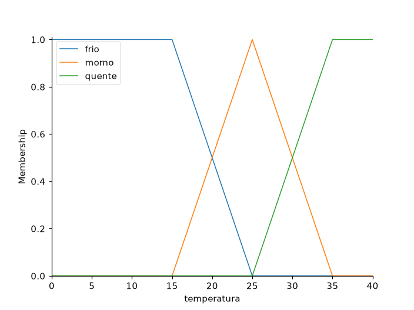
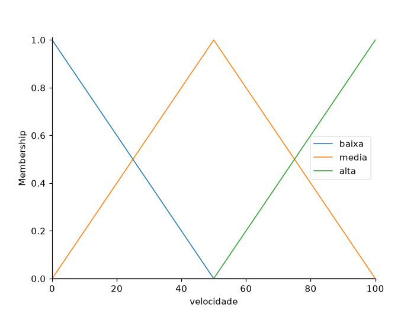
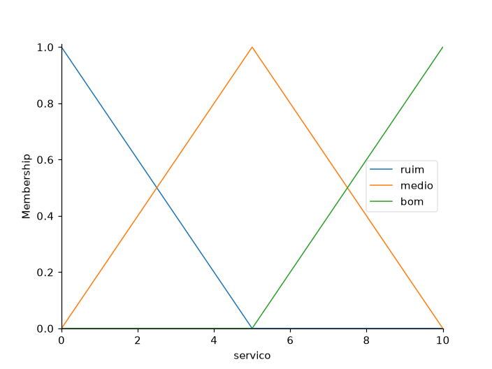
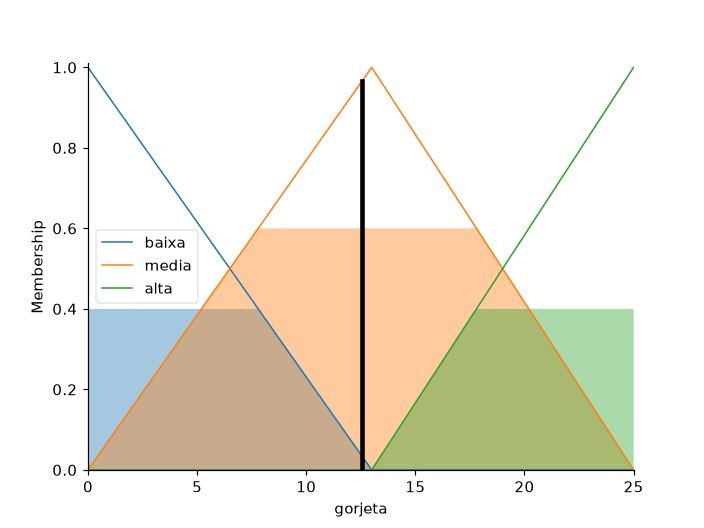
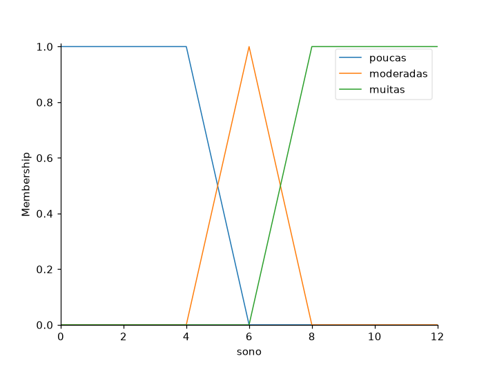
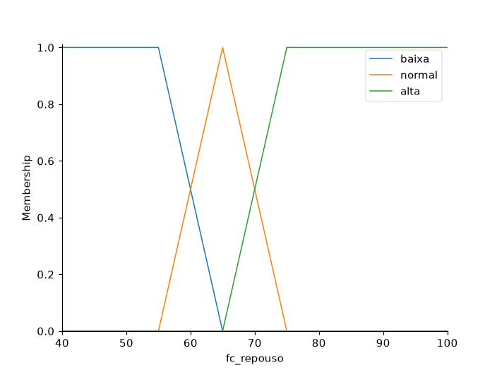
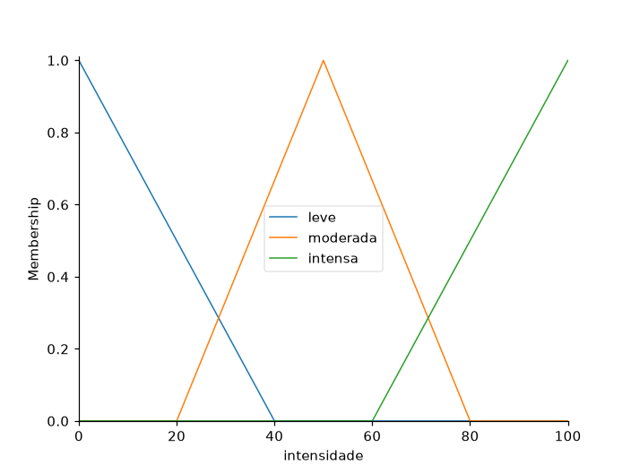
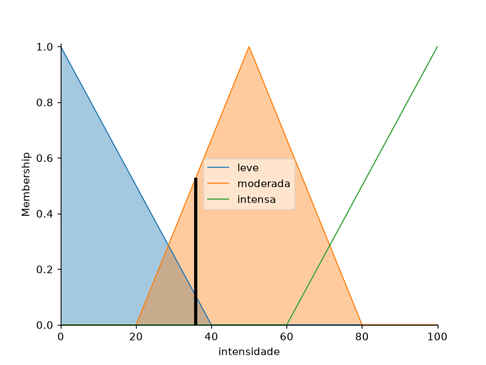

# Resultados — Aula 09 (Lógica Fuzzy)

Códigos completos em [lab01_aula09.py](lab01_aula09.py), [lab02_aula09.py](lab02_aula09.py) e [lab03_aula09.py](lab03_aula09.py). Tudo foi executado de verdade — nenhuma saída abaixo foi inventada.

> **Nota de ambiente:** nenhuma biblioteca de lógica fuzzy estava instalada; instalei `scikit-fuzzy` (e suas dependências `scipy`/`networkx`) antes de rodar os três laboratórios.

---

## LAB 01 — Ventilador Fuzzy (pronto)

Código fornecido pronto, executado sem alterações na lógica (só adicionei `savefig` para guardar os gráficos).

```
LAB 01 — VENTILADOR FUZZY (temperatura -> velocidade)
10°C -> ventilador a 17%
20°C -> ventilador a 44%
25°C -> ventilador a 50%
30°C -> ventilador a 56%
38°C -> ventilador a 83%
```




### O que a lógica fuzzy realiza aqui

Em vez de uma regra rígida do tipo "se temperatura > 25, ligue o ventilador na velocidade máxima", a lógica fuzzy permite que a temperatura pertença, ao mesmo tempo e em graus diferentes, a mais de uma categoria — por exemplo, 20°C é um pouco "frio" (grau 0,33) e um pouco "morno" (grau 0,5) simultaneamente (ver gráfico acima). O sistema calcula o grau de pertinência da entrada em cada conjunto (frio/morno/quente), aplica as regras SE-ENTÃO correspondentes, combina ("agrega") o resultado de todas as regras que dispararam, e por fim **defuzzifica** esse resultado agregado (calcula o centróide da área) para devolver um número único e contínuo (a % do ventilador). É por isso que a saída cresce de forma suave e gradual com a temperatura (17% → 44% → 50% → 56% → 83%), em vez de dar "saltos" bruscos entre faixas — imitando o raciocínio humano de "quanto mais quente, mais forte o vento", sem precisar definir um limite exato onde uma categoria "acaba" e a outra "começa".

---

## LAB 02 — Sistema Fuzzy da Gorjeta (com experimentos)

### Adaptação necessária

O roteiro original usa `input()` para ler as notas do teclado — como este script roda de forma automática (sem ninguém digitando), troquei a leitura interativa por uma lista fixa de cenários de teste, incluindo o par padrão do roteiro (7, 3) e os três pares que o próprio roteiro pede para testar no Experimento 5: (0,0), (10,10) e (5,5). A lógica fuzzy (variáveis, conjuntos, regras, simulação) continua exatamente a mesma.

```
LAB 02 — SISTEMA FUZZY DA GORJETA (cenários de teste fixos)
[Padrão do roteiro     ] servico=   7 | comida=   3 => gorjeta = 12.55%
[Pior caso possível    ] servico=   0 | comida=   0 => gorjeta = 4.33%
[Melhor caso possível  ] servico=  10 | comida=  10 => gorjeta = 21.00%
[Caso neutro/médio     ] servico=   5 | comida=   5 => gorjeta = 12.67%
```




### Experimento 1 — Regra 2 com E em vez de só "servico médio"

```
(servico=7, comida=3): regra 2 original = 12.55% | regra 2 com E = 12.55%
(servico=7, comida=9): regra 2 original = 14.77% | regra 2 com E = 16.81%
```

Em (7,3) os dois deram o mesmo valor — mas isso é coincidência: por acaso `comida['medio']` em x=3 vale exatamente 0,6, igual a `servico['medio']` em x=7, então o `&` (mínimo) não reduz nada (`min(0.6, 0.6) = 0.6`). Troquei para (7,9) para mostrar o efeito de verdade: ali `comida['medio']` cai para 0,2, então a regra com E dispara a "média" bem mais fraca (`min(0.6, 0.2) = 0.2` em vez de 0,6), deixando a "alta" (disparada por `comida['bom']=0.8`) dominar mais o resultado — por isso a gorjeta **sobe** de 14,77% para 16,81%. Isso confirma o que a teoria prevê: **E (mínimo)** exige as duas condições fortes ao mesmo tempo (mais restritivo), enquanto a regra original dependia só do serviço.

### Experimento 2 — Trapézios em vez de triângulos

```
(servico=7, comida=3) com trapézios: 12.46% (triângulos originais: 12.55%)
```

A diferença numérica foi pequena (12,46% vs 12,55%), mas o comportamento junto às bordas muda: um trapézio tem um "platô" onde a pertinência fica em 1,0 por um intervalo, em vez de um único ponto de pico como no triângulo — isso deixa a transição entre categorias um pouco mais suave perto do centro de cada conjunto, mas o resultado final para este par específico de notas fica muito parecido porque (7,3) não cai bem na região onde as formas mais diferem.

### Experimento 3 — Defuzzificação: centroid vs mom

```
método=centroid : gorjeta = 12.55%
método=mom      : gorjeta = 12.75%
```

`centroid` (padrão) calcula o "centro de massa" de toda a área agregada — leva em conta a forma inteira. `mom` ("mean of maximum") olha só para os pontos onde a pertinência agregada é **máxima** e tira a média das posições deles, ignorando o resto da área. Como a área agregada aqui não é simétrica, os dois métodos dão valores próximos, mas não idênticos (12,55% vs 12,75%) — `mom` tende a "colar" mais perto do pico de maior força, enquanto `centroid` é influenciado por toda a área, inclusive os lados mais compridos/assimétricos da figura.

### Experimento 4 — Novo conjunto "excelente" no serviço

```
(servico=9.5, comida=5) => gorjeta = 20.80%
(servico=8.5, comida=5) => gorjeta = 20.80%
(servico=7.0, comida=5) => gorjeta = 15.28%
```

Adicionei `servico["excelente"] = trimf([8,10,10])` e a regra `SE servico é excelente ENTÃO gorjeta é alta`. Curiosamente, 8,5 e 9,5 deram o **mesmo** resultado (20,80%) — não é coincidência de arredondamento, é simetria matemática: a essa altura, `bom` (que cai de 8 a 10) e `excelente` (que sobe de 8 a 10) são espelhadas em torno de x=9, então `max(bom(8.5), excelente(8.5)) = max(0.75, 0.25) = 0.75` é **igual** a `max(bom(9.5), excelente(9.5)) = max(0.25, 0.75) = 0.75` — ambas as regras acabam disparando a "alta" com a mesma força 0,75, dando a mesma gorjeta. Já em servico=7 (fora da faixa do "excelente"), o resultado cai para 15,28%, porque aí só a regra do "médio"/"bom" originais entram em jogo.

---

## LAB 03 — Sistema Fuzzy do Zero

### Etapa 1 — Definição do problema

**Problema escolhido:** decidir a intensidade de treino físico recomendada para o dia, a partir de duas entradas: horas de sono da noite anterior e frequência cardíaca (FC) de repouso medida ao acordar. Hoje essa decisão é tomada de forma informal pela própria pessoa ou por um personal trainer, usando regras de bom senso vagas ("dormi mal, hoje vou pegar mais leve"), sem cálculo exato algum. As entradas são naturalmente descritas em termos vagos ("dormiu pouco", "FC alta") e não têm um limite rígido que separe uma categoria da outra — dormir 5h50 não é qualitativamente diferente de dormir 6h10, mas um `if sono < 6` trataria os dois casos como opostos. A decisão também não é trivial: nenhuma das duas variáveis isoladas decide a intensidade — é preciso combinar as duas (alguém com pouco sono mas FC de repouso baixa pode estar fisiologicamente recuperado; alguém com bastante sono mas FC alta pode estar estressado ou doente). Por isso a lógica fuzzy é adequada: ela modela essa transição suave entre categorias e combina múltiplos fatores vagos através de regras linguísticas interpretáveis, em vez de um limiar arbitrário.

### Etapa 2 — Modelagem

| Variável | Tipo | Universo | Termos linguísticos | Forma |
|---|---|---|---|---|
| `sono` | Entrada | 0 a 12 horas | poucas / moderadas / muitas | trapézio / triângulo / trapézio |
| `fc_repouso` | Entrada | 40 a 100 bpm | baixa / normal / alta | trapézio / triângulo / trapézio |
| `intensidade` | Saída | 0 a 100 % | leve / moderada / intensa | triângulo / triângulo / triângulo |

Gráficos das funções de pertinência:





**Base de regras** (10 regras — grade completa 3×3 com **E**, mais 1 regra de segurança com **OU**):

1. SE sono é poucas **E** FC é alta ENTÃO intensidade é leve
2. SE sono é poucas **E** FC é normal ENTÃO intensidade é leve
3. SE sono é poucas **E** FC é baixa ENTÃO intensidade é moderada
4. SE sono é moderadas **E** FC é alta ENTÃO intensidade é leve
5. SE sono é moderadas **E** FC é normal ENTÃO intensidade é moderada
6. SE sono é moderadas **E** FC é baixa ENTÃO intensidade é intensa
7. SE sono é muitas **E** FC é alta ENTÃO intensidade é moderada
8. SE sono é muitas **E** FC é normal ENTÃO intensidade é intensa
9. SE sono é muitas **E** FC é baixa ENTÃO intensidade é intensa
10. SE sono é poucas **OU** FC é alta ENTÃO intensidade é leve *(regra de segurança: um único sinal de alerta já é suficiente para recomendar cautela, mesmo fora da combinação exata das regras 1–9)*

### Etapa 3 — Implementação

Código completo em [lab03_aula09.py](lab03_aula09.py).

### Etapa 4 — Testes (5 situações, mínimo exigido era 4)

```
[Noite ruim, corpo estressado]
  Entradas: sono = 3.5h | FC repouso = 82 bpm
  Saida do sistema: intensidade = 13.3%
  Resposta esperada: leve (baixa intensidade)

[Dormiu bem, corpo recuperado]
  Entradas: sono = 8.5h | FC repouso = 52 bpm
  Saida do sistema: intensidade = 86.7%
  Resposta esperada: intensa (alta intensidade)

[Pouco sono, mas FC baixa (recuperado)]
  Entradas: sono = 4.0h | FC repouso = 48 bpm
  Saida do sistema: intensidade = 35.7%
  Resposta esperada: moderada (compensacao parcial)

[Sono moderado, FC normal (dia comum)]
  Entradas: sono = 6.5h | FC repouso = 68 bpm
  Saida do sistema: intensidade = 48.8%
  Resposta esperada: moderada (dia tipico)

[Dormiu muito, mas FC alta (possivel estresse/doenca)]
  Entradas: sono = 9.0h | FC repouso = 85 bpm
  Saida do sistema: intensidade = 35.7%
  Resposta esperada: moderada (sinal de alerta da FC)
```



### Análise dos testes

Os 5 casos confirmam o comportamento esperado: a pior combinação (pouco sono + FC alta) deu a menor intensidade (13,3%), a melhor combinação (sono bom + FC baixa) deu a maior (86,7%), e os casos "mistos" (um sinal bom, um sinal ruim) ficaram no meio (35,7%–48,8%), exatamente como o raciocínio humano esperaria.

Vale destacar algo que só percebi ao comparar os números: os testes 3 e 5 deram o **mesmo** resultado (35,7%), apesar de serem cenários bem diferentes (pouco sono/FC baixa vs. muito sono/FC alta). Investigando, não é coincidência de arredondamento: em ambos os casos a regra de segurança (regra 10, com OU) dispara a "leve" em força máxima (1,0) ao mesmo tempo em que uma regra da grade (regra 3 ou regra 7) dispara a "moderada" também em força máxima (1,0) — ou seja, as duas situações produzem exatamente a mesma área agregada (união de "leve" cheia + "moderada" cheia), e por isso o mesmo centróide. Isso mostra uma propriedade real do sistema: a regra de segurança "nivela" certos pares de cenários diferentes para a mesma saída sempre que ela e uma regra da grade disparam ambas em força total — um efeito colateral interessante de combinar uma regra OU "ampla" com uma grade E "específica" na mesma base de regras.
